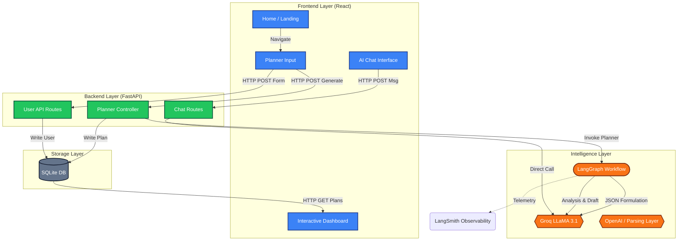
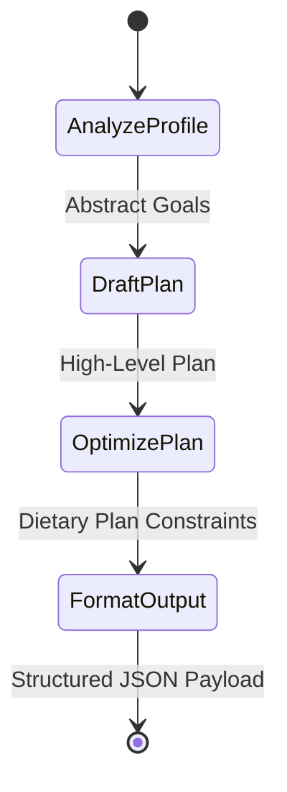

# System Analysis & Architectural Report

This document outlines the current state of the **AI Smart Nutrition & Meal Planner** project, focusing on code quality, observability, system architecture (infographics), and testing strategies.

---

## 1. Code Quality Assessment

### Architectural Strengths
- **Separation of Concerns:** The backend effectively isolates route handlers (`api/`), database models (`models.py`, `schemas.py`), and complex domain logic (`services/ai_agent.py`). 
- **Modern Tech Stack:** The frontend leverages Vite and React resulting in rapid HMR and lightweight bundle sizes.
- **Styling Paradigm:** Tailwind CSS paired with Tailwind config tokens establishes a scalable, robust atomic CSS structure that avoids widespread CSS footprint bloat.
- **Componentized State:** React components successfully encapsulate isolated async states (loading spinners, error catching) keeping data flow unidirectional.

### Areas for Improvement
- **Frontend Component Granularity:** UI components like the cards inside `Dashboard.jsx` and inputs inside `PlannerInput.jsx` are growing quite large. Extracting them into smaller, reusable UI atoms (e.g., `<MealCard />`, `<SliderInput />`) would increase testability and long-term scaling.
- **Error Boundaries:** The frontend currently utilizes basic generic fallbacks. Implementing strict React Error Boundaries would prevent isolated component crashes from whiting-out the entire application view.

---

## 2. Observability & Monitoring

### Currently Implemented
- **LLM Tracing (LangSmith):** The system has deep observability into the AI orchestration layer thanks to `LANGCHAIN_TRACING_V2=true` configured in the backend environment. Every LangChain graph invocation, token consumption, and model latency is actively tracked inside the LangSmith dashboard.
- **Access Logging:** Uvicorn natively logs HTTP request lifecycles.

### Missing & Recommended
> [!TIP]
> **Expand Backend Logging**: Transform the raw `print()` statements into structured Python `logging` using standard JSON log formats, allowing them to be digested by tools like Datadog or ELK.
- **Frontend Telemetry:** There is no user-session tracing. Implementing Sentry, LogRocket, or OpenTelemetry would trace frontend exceptions and unhandled promise rejections directly back to the active user session.

---

## 3. System Architecture & Infographic

The data flow primarily orchestrates user profiles against state-driven AI graph handlers to structure unformatted text into SQL schemas.

### LangGraph Generation Pipeline

---

## 4. Testing Analysis

> [!WARNING]
> The current system has zero automated test coverage. While manual testing verifies happy-path MVP functionality, regressions are highly probable without test hooks.

### Recommended Testing Strategy

#### 1. Backend Unit Tests (`pytest`)
- Mock the SQLAlchemy database engine using overriding dependency injection so `schemas` validation and endpoint paths can be verified without touching disk.
- Mock the `ChatGroq` responses to verify deterministic graph traversal in `build_planner_graph()`.

#### 2. Frontend Component Tests (`Vitest` + `React Testing Library`)
- Assert that `<PlannerInput />` properly rejects form submissions if budget integers are malformed or string limits are exceeded.
- Snapshot testing of complex animation layers to ensure `framer-motion` keys aren't unintentionally omitted during refactoring.

#### 3. End-to-End Tests (`Playwright`)
- Simulate creating a profile on the Smart Input page, traversing to the Dashboard, intercepting the mocked Server JSON, and ensuring Recharts completely renders the predicted Macro allocations without UI thread blocking.
